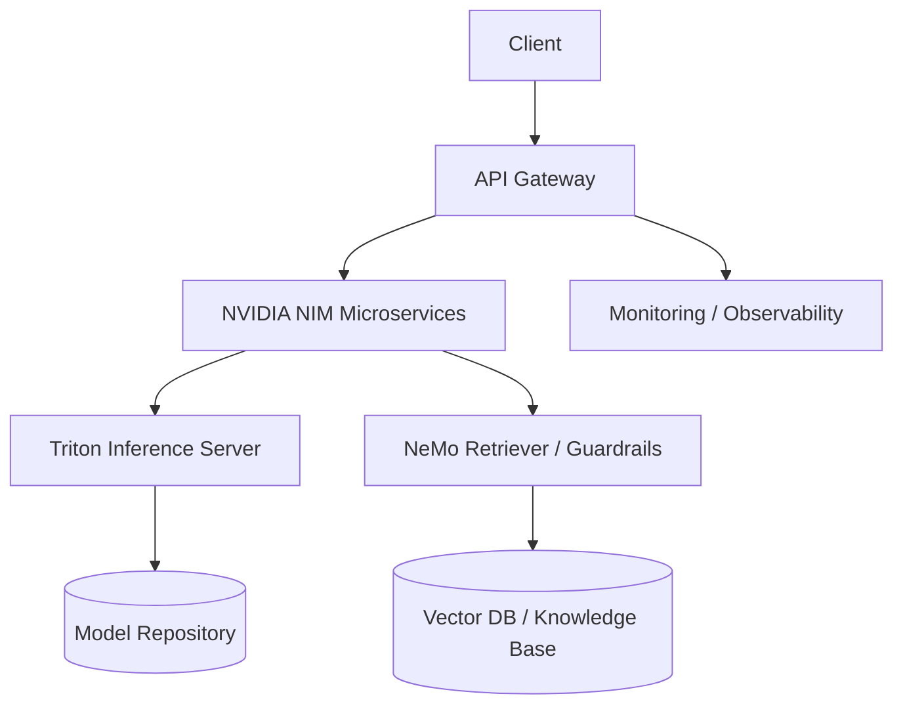

# Nebius x NVIDIA Global AI Hackathon 2026 - Submission Showcase

> **Team:** [Your Team Name]  
> **Track:** [AI Agents / LLM Optimization / RAG / Multimodal / Infrastructure]  
> **Submission:** [Project Name]

---

## 🎯 Project Overview

**[Project Name]** is a [one-sentence description] built for the **Nebius x NVIDIA Global AI Hackathon 2026**.

### Problem Statement
[Describe the problem you're solving - 2-3 sentences]

### Solution
[Describe your solution and unique approach - 3-4 sentences]

### Key Innovation
[What makes your approach novel? Technical differentiation?]

---

## 🏗️ Architecture



### Components
| Component | Technology | Purpose |
|-----------|------------|---------|
| LLM Inference | NVIDIA NIM / TensorRT-LLM | High-throughput token generation |
| Embeddings | NeMo Retriever | Semantic search & retrieval |
| Guardrails | NeMo Guardrails | Safety, hallucination prevention |
| Orchestration | [LangGraph / Custom] | Agent workflow management |
| Serving | Triton Inference Server | Multi-model, dynamic batching |
| Infrastructure | Nebius AI Cloud / Kubernetes | Scalable GPU compute |

---

## 🚀 Quick Start

### Prerequisites
- Docker & Docker Compose
- NVIDIA Container Toolkit (`nvidia-docker`)
- Nebius AI Cloud account (or local GPU)
- Python 3.10+

### Installation

```bash
# Clone the repository
git clone https://github.com/rishisf12/nebius-nvidia-hackathon-showcase.git
cd nebius-nvidia-hackathon-showcase

# Set up environment
cp .env.example .env
# Edit .env with your API keys (NVIDIA API, Nebius, etc.)

# Start services
docker compose up -d

# Verify health
curl http://localhost:8000/health
```

### Run Demo

```bash
# Interactive CLI
python -m src.cli

# Or use the API
curl -X POST http://localhost:8000/api/v1/chat \
  -H "Content-Type: application/json" \
  -d '{"message": "Your query here", "session_id": "demo"}'
```

---

## 🧪 Evaluation & Benchmarks

### Performance Metrics
| Metric | Value | Target |
|--------|-------|--------|
| Latency (p50) | XX ms | < 100ms |
| Latency (p99) | XX ms | < 500ms |
| Throughput | XX tok/s | > 1000 tok/s |
| Cost per 1M tokens | $X.XX | < $1.00 |

### Quality Metrics
| Benchmark | Score | Baseline |
|-----------|-------|----------|
| MMLU | XX% | XX% |
| HumanEval | XX% | XX% |
| Custom Eval | XX% | XX% |

### Hardware Tested
- **GPU:** H100 / A100 / L40S (Nebius Cloud)
- **Config:** 1x / 4x / 8x GPU
- **Quantization:** FP8 / INT4 / AWQ

---

## 📁 Project Structure

```
nebius-nvidia-hackathon-showcase/
├── .github/
│   └── workflows/           # CI/CD pipelines
├── docker/
│   ├── Dockerfile.api       # FastAPI service
│   ├── Dockerfile.worker    # Background workers
│   └── triton/              # Triton model repo config
├── helm/                    # Kubernetes Helm charts
├── src/
│   ├── api/                 # FastAPI routes
│   ├── agents/              # Agent implementations
│   ├── core/                # Core utilities, config
│   ├── models/              # Model wrappers (NIM, local)
│   ├── pipelines/           # RAG, evaluation pipelines
│   └── cli.py               # Interactive demo
├── tests/
│   ├── unit/
│   ├── integration/
│   └── benchmarks/          # Performance tests
├── notebooks/               # Exploration, analysis
├── scripts/                 # Deployment, setup scripts
├── .env.example
├── docker-compose.yml
├── pyproject.toml
├── requirements.txt
└── README.md
```

---

## 🔧 Configuration

### Environment Variables
```bash
# NVIDIA
NVIDIA_API_KEY=your_nvidia_api_key
NIM_MODEL_NAME=meta/llama3-70b-instruct

# Nebius
NEBIUS_API_KEY=your_nebius_key
NEBIUS_CLUSTER_ID=your_cluster_id

# Vector DB
QDRANT_URL=http://localhost:6333
QDRANT_API_KEY=

# Observability
LANGSMITH_API_KEY=
PROMETHEUS_URL=
GRAFANA_URL=
```

### Model Configuration (`config/models.yaml`)
```yaml
models:
  - name: llama3-70b-instruct
    type: nim
    nim_model: meta/llama3-70b-instruct
    tensorrt_llm: true
    max_batch_size: 32
  
  - name: bge-large-en
    type: nim
    nim_model: nvidia/nv-embedqa-e5-v5
    
  - name: nemotron-3-ultra
    type: nim
    nim_model: nvidia/nemotron-3-ultra
```

---

## 📈 Monitoring & Observability

- **Metrics:** Prometheus + Grafana dashboards
- **Tracing:** LangSmith / OpenTelemetry
- **Logging:** Structured JSON logs
- **Alerting:** PagerDuty / Slack webhooks

### Key Dashboards
- Request latency & throughput
- GPU utilization & memory
- Token generation speed
- Error rates & fallback triggers

---

## 🧰 NVIDIA Technologies Used

| Technology | Usage | Documentation |
|------------|-------|---------------|
| **NVIDIA NIM** | LLM/Embedding microservices | [docs.nvidia.com/nim](https://docs.nvidia.com/nim) |
| **TensorRT-LLM** | FP8/INT4 quantization, speculative decoding | [github.com/NVIDIA/TensorRT-LLM](https://github.com/NVIDIA/TensorRT-LLM) |
| **NeMo Retriever** | Embedding + reranking pipeline | [docs.nvidia.com/nemo/retriever](https://docs.nvidia.com/nemo/retriever) |
| **NeMo Guardrails** | Input/output rails, fact-checking | [docs.nvidia.com/nemo/guardrails](https://docs.nvidia.com/nemo/guardrails) |
| **Triton Inference Server** | Multi-model serving, ensemble | [github.com/triton-inference-server](https://github.com/triton-inference-server/server) |
| **NVIDIA NeMo** | Fine-tuning, customization | [docs.nvidia.com/nemo](https://docs.nvidia.com/nemo) |
| **CUDA / cuDNN** | Custom kernels, optimization | [developer.nvidia.com/cuda](https://developer.nvidia.com/cuda) |

---

## 🎥 Demo

### Video Walkthrough
[](https://youtu.be/VIDEO_ID)

### Screenshots
| UI | Architecture | Metrics |
|----|--------------|---------|
|  |  |  |

---

## 🏆 Hackathon Deliverables

- [ ] **Working Demo** - Deployed and accessible
- [ ] **Source Code** - Public repository with MIT/Apache-2.0 license
- [ ] **Documentation** - Setup, API docs, architecture
- [ ] **Presentation** - 3-min pitch deck (`docs/presentation.pdf`)
- [ ] **Video** - 2-3 min demo video
- [ ] **Blog Post** - Technical writeup (`docs/blog-post.md`)

---

## 📚 Resources & References

- [Nebius x NVIDIA Hackathon Page](https://nebiusglobalaihackathon.devpost.com/)
- [NVIDIA NIM Documentation](https://docs.nvidia.com/nim)
- [Nebius AI Cloud Docs](https://docs.nebius.com)
- [Triton Inference Server](https://github.com/triton-inference-server/server)
- [TensorRT-LLM](https://github.com/NVIDIA/TensorRT-LLM)

---

## 👥 Team

| Member | Role | GitHub |
|--------|------|--------|
| Rishi | AI/ML Engineer, Backend | [@rishisf12](https://github.com/rishisf12) |
| [Teammate] | [Role] | [@handle] |

---

## 📄 License

MIT License - see [LICENSE](LICENSE) for details.

---

## 🙏 Acknowledgments

- **NVIDIA** for NIM, NeMo, TensorRT-LLM, Triton
- **Nebius** for AI Cloud credits and infrastructure
- **Hackathon organizers** for the opportunity

---

⭐ **Star this repo if you like our project!**  
🐛 **Found a bug?** Open an issue.  
💡 **Have an idea?** Start a discussion.